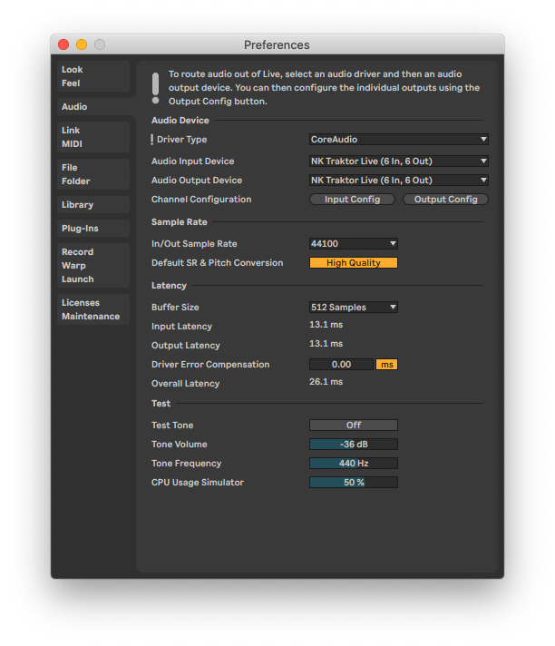
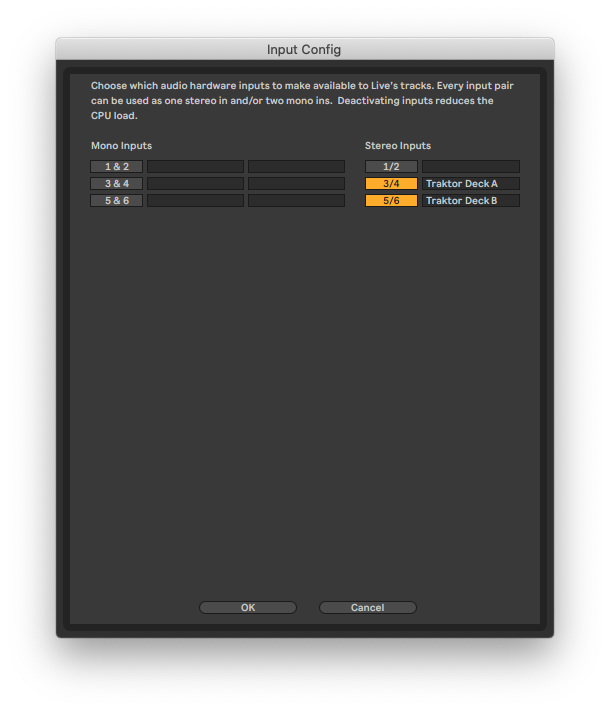
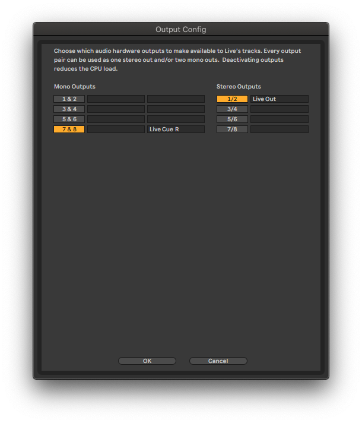

# Traktor Live v2

 

Traktor Pro mix template using multiple MIDI controllers. This is a 'fork' of <https://github.com/dotherightthing/traktor-live-v1/> and changes the supported MIDI controllers.

Includes Ableton Live starter file.

I've documented this for my own benefit, but please help yourself to any part you find useful.

---

> **This project is no longer maintained - please see [version 3](https://github.com/dotherightthing/traktor-live-v3/).**

---

## Purpose

The purpose of this setup is to replace Traktor Pro’s Remix Decks and Loop Recorder with Ableton Live.

### Replace Traktor Pro’s Remix Decks

Traktor Pro’s Remix Decks mostly work fine when resampling directly from a deck.

However when keylock pitching is used, the recorded pitch often does not match the source deck.

### Replace Traktor Pro’s Loop Recorder

To capture global FX like reverb and gating, Traktor Pro’s Loop Recorder must be used.

The Loop Recorder is problematic because it records loops slightly too long. Samples glitch on repeat and drift out of sync with the source material.

---

## Components

1. **[Physical Sound Card](#1-physical-sound-card):**
    * Macbook Pro (15-inch, 2018 / macOS v10.15.7)
    * External Headphones (headphones or [Minirig](https://www.minirig.co.nz/) plugged into headphone jack)
2. **[Virtual Sound Card](#2-virtual-sound-card):**
    * [Rogue Amoeba Loopback](#rogue-amoeba-loopback)
3. **[DJ Decks and MIDI Clock](#3-dj-application-and-midi-clock):**
    * [Native Instruments Traktor Pro](#native-instruments-traktor-pro)
4. **[Mixer and Sampler](#4-mixer-and-sampler):**
    * [Ableton Live](#ableton-live)
    * [Plugins](#plugins)
5. **[Controller Mapping](#5-controller-mapping):**
    * [nativeKONTROL ClyphX Pro](#nativekontrol-clyphx-pro)
    * [Native Instruments Traktor Pro Controller Manager](#native-instruments-traktor-pro-controller-manager)
    * [KORG nanoKEY Studio](#korg-nanokey-studio)
    * [Native Instruments Traktor Kontrol X1](#native-instruments-traktor-kontrol-x1)
    * [Native Instruments Traktor Kontrol Z1](#native-instruments-traktor-kontrol-z1)
    * [Ableton Push2](#ableton-push2)
    * [Midi Fighter Twister](#midi-fighter-twister)
6. **[Controller Overlay](#6-controller-overlay):**
    * [Inkscape](#inkscape)
    * [Cricut](#cricut)
7. **[Mix Recorder](#7-mix-recorder):**
    * [Rogue Amoeba Audio Hijack](#rogue-amoeba-audio-hijack)
8. **[Launch Script](#8-launch-script):**
    * [NPM](#npm)
9. **[Further Reading](#9-further-reading)**
    * [FAQs](#faqs)
    * [References](#references)

---

### 1. Physical Sound Card

#### MacBook Pro

This setup is for the Traktor Kontrol Z1. Mixing is only done on headphones, so the master mix goes to both Left and Right channels (for monitoring and recording with Audio Hijack) and cueing goes to the Right channel (this is not recorded). This is a variation on the [split cue](https://www.digitaldjtips.com/2019/05/dj-tips-tricks-what-split-cue-is-why-you-may-want-to-use-it/) approach.

---

### 2. Virtual Sound Card

#### Rogue Amoeba Loopback

* Product: <https://rogueamoeba.com/loopback/>
* Version: 2

Loopback allows additional stereo pairs to be added to an existing sound card. These pairs can then be used for internal routing via input and output settings in Traktor Pro and Ableton Live.

Some web tutorials use Jack Audio instead. I prefer Loopback’s routing UI.

In order to be able to choose which Traktor Pro deck to sample from, both decks are routed to Ableton Live.

##### Project file

* `loopback/Devices.plist` (from `Users/Name/Application Support/Loopback/Devices.plist`)

---

### 3. DJ Application and MIDI Clock

#### Native Instruments Traktor Pro

* Product: <https://www.native-instruments.com/en/products/traktor/dj-software/traktor-pro-3/>
* Version: 3.4.2

---

### 4. Mixer and Sampler

#### Ableton Live

* Product: <https://www.ableton.com/en/live/>
* Version: 10

##### Project file

1. `ableton-live/traktor-live-v2 Project/traktor-live-v2.als`

Contains a 2 channel mixer and an 8 channel sampler (Deck A x3 + Deck B x3 + Resample x1 + Chop x1).

##### Audio

1. Driver Type: `CoreAudio`
2. Audio Input Device: `Traktor Live v1 (8 In, 8 Out)`
3. Audio Output Device: `Traktor Live v1 (8 In, 8 Out)`
4. Channel Configuration
   1. Input Config:
      * `3/4: Traktor Pro Deck A`
      * `5/6: Traktor Pro Deck B`
   2. Output Config:
      * `1/2: Live Out`
      * `7/8: Live Cue R` (channel `8`)

##### UI (top left)

1. Click `Ext` so that it lights up - Ableton Live will now follow the Sync source (Traktor Pro Virtual Output)
2. Global launch quantisation: `1 Bar`

---

### 5. Controller Mapping

#### nativeKONTROL ClyphX Pro

* ClyphX Pro and Macrobat
  * Product: <https://isotonikstudios.com/product/clyphx-pro/>
  * Version: 1.2.0
* ClyphX Pro Ableton Live Hotfix:
  * Product: <https://forum.nativekontrol.com/post/21021>
* ClyphX Pro Bindings
  * Product: <https://isotonikstudios.com/product/clyphx-pro-bindings/>
* ClyphX Pro G-Controls
  * Product: <https://forum.nativekontrol.com/thread/3906/beta-controls-accessory-clyphx-pro>
* ClyphX Pro Shift Action
  * Product: <https://forum.nativekontrol.com/thread/3562/adding-shift-functionality-controls-oscs>

##### ClyphX Pro terminology

* **Button Binding** (Controller) - Defined in `Button Bindings.txt`, binds a MIDI control to a Live parameter (without specifying an Action List); supports LED feedback (which an X-Control doesn't)
* **Encoder Binding** (Controller) - Defined in `Encoder Bindings.txt`, binds a continuous MIDI control to a continuous Live parameter (without specifying an Action List)
* **G-Control** (Controller) - Defined in `G-Controls.txt`, similar to an X-Control, but supports additional gestures; doesn't support Variables
* **Macro** (Global) - Defined in `Macros.txt`, shorthand for a list of actions; supports Variables
* **Startup Actions** (Global) - X-Trigger defined in `Preferences.txt`, triggers actions when Live opens
* **User Actions** (Global) - Custom Python scripts which allow for conditional creation and triggering of Actions / Action Lists based on the state of the LOM (Live Object Model); supports Variables
* **Variable** (Global) - Defined in `Variables.txt`, shorthand for a string value
* **X-Clip** (Global) - X-Trigger in the form of a Live clip, triggers actions when launched
* **X-Cue** (Global?) - X-Trigger in the form of a Live locator, triggers actions when passed
* **X-Scene** (Global?) - X-Trigger in the form of a Live scene, triggers actions when launched
* **X-Control** (Controller) - X-Trigger defined in `X-Controls.txt`, targetting a MIDI control which triggers an actions when used
* **X-OSC** (Controller?) - X-Trigger defined in `X-OSC.txt`, targetting an OSC address which triggers when receiving a value
* **X-Trigger** - Event that triggers scripted Action Lists. These can include MIDI commands which affect Live (and Traktor, via the MIDI Channel set up to output to the *Traktor Pro Virtual Input*)
* **XT Script** - Adds support for an additional MIDI controller, defined in a sub folder containing ClyphX Pro scripts for that controller
* **Macrobat** - Adds special modes to racks/macros

Note: A button / MIDI message can be used for EITHER X-Controls OR Button Bindings OR G-Controls.

##### nativeKONTROL ClyphX Pro configuration files: Global

1. `clyphx-pro/ClyphX_Pro/Macros.txt`
1. `clyphx-pro/ClyphX_Pro/Preferences.txt`
1. `clyphx-pro/ClyphX_Pro/Variables.txt`

##### Ableton Live MIDI setup (Traktor)

The default ClyphX Pro 'controller' is primarily used to sync MIDI clock between Traktor Pro and Ableton Live (MIDI input).

Additionally, ClyphX Pro is used to send scripted MIDI messages to Traktor Pro (MIDI output). When this is done, channel `16` is used to make it clear that Traktor Pro is being targetted. See also the M4L Device on the master channel.

Note: `MIDI Clock Sync Delay` was initially set using Traktor Pro's internal mixer, with *Cue out* used to sync Traktor Pro and Ableton Live's metronomes. Ableton Live now functions as the external mixer and syncing does not appear to be an issue anymore.

* Control Surface: `ClyphX Pro`
* Input: `Traktor Pro Virtual Output` (for MIDI Clock Sync)
  * Track: `Off`
  * Sync: `On`
  * Remote: `Off`
* Output: `Traktor Pro Virtual Input` (for sending MIDI to Traktor)
  * Track: `Off`
  * Sync: `Off`
  * Remote: `Off`
* Takeover Mode: Value Scaling

##### Traktor Pro Controller Manager Device Setup

* Device: `ClyphX Pro MIDI messages v1.0`
* TSI: `traktor-pro/clyphx-pro-v1-0.tsi`
* In-port: Traktor Virtual Input
* Out-port: None

Push the `Learn` button in this Traktor device, then use the control which you wish to map to it.

---

#### Native Instruments Traktor Pro Controller Manager

Part of Traktor Pro 3: <https://support.native-instruments.com/hc/en-us/articles/209590569-How-to-Use-the-Controller-Manager-in-TRAKTOR>

`.tsi` templates map control surfaces and supporting software to Traktor Pro's interface API.

1. `traktor-pro/clock.tsi` - for MIDI clock sync (TBC - if not for another project)
1. `traktor-pro/clyphx-pro-v1-0.tsi` - for sending MIDI from Live to Traktor
1. `traktor-pro/korg-nanokey-studio-v1.tsi` - key adjust
1. `traktor-pro/traktor-live-v2.tsi` - Traktor Settings (Preferences > Export)
1. `traktor-pro/traktor-kontrol-z1-default.tsi` - default mappings (unit is used in MIDI mode)

##### Project file

1. Preferences > Import > `traktor-pro/*.tsi`

##### Miscellaneous settings

* Offset: `0 Ms` (top of mixer section)

---

#### KORG nanoKEY Studio

* Product: <https://www.korg.com/us/products/computergear/nanokey_studio/>
* Version: 1.08
* Editor: <https://www.korg.com/us/support/download/software/1/133/1355/>

The nanoKEY is only used to pitch loops in Traktor, via key adjust.

##### KORG KONTROL Editor configuration files

1. The scene's data: `korg-kontrol-editor/traktor-live-v2.nanokey_st_data`
2. Set containing all scenes: `korg-kontrol-editor/traktor-live-v2.nanokey_st_set`

Double-click to open the set files, then select Communication > Write Scene Data.

---

#### Native Instruments Traktor Kontrol X1

* Product: <https://www.native-instruments.com/en/products/traktor/dj-controllers/traktor-kontrol-x1/>
* Version: 2

##### Features

* Default:
   1. SHIFT + left encoder moves the loop by the length of the loop
   2. Left/Right LOAD button loads track into Deck A/B
   3. SHIFT + Left/Right? LOAD button toggles SNAP
* This version:
   1. SHIFT + left encoder moves the loop by the length set using one of the top 8 LED buttons
   2. Left/Right LOAD button selects Deck A/B
   3. SHIFT + Left/Right LOAD button loads track into Deck A/B
   4. Left FX buttons trigger BPM /2 and BPM x2 on selected deck
   5. Right FX buttons trigger Beatjump -1/16 / +1/16 on selected deck

##### Ableton Live MIDI setup

N/A

##### Traktor Pro Controller Manager Device Setup

* Device: `Traktor Kontrol X1 v1.0`
* TSI: `traktor-pro/traktor-kontrol-x1-v1-0.tsi`
* In-port: `KontrolX1MK2`
* Out-port: `KontrolX1MK2`

---

#### Native Instruments Traktor Kontrol Z1

* Product: <https://www.native-instruments.com/en/products/traktor/dj-controllers/traktor-kontrol-z1/>
* Version: 1

##### Ableton Live MIDI setup

* Control Surface: `ClyphX Pro XTD`
* Input: `Traktor Kontrol Z1 Input`
  * Track: `On`
  * Sync: `Off`
  * Remote: `On`
* Output: `Traktor Kontrol Z1 Output`
  * Track: `On`
  * Sync: `Off`
  * Remote: `On`

###### Features

* L/R HI/MID/LOW control DECK A/B Device 1 EQ
* L/R FILTER control DECK A/B Device 1 Pan (Macrobat)
* L/R VOLUME control DECK A/B Device 1 Vol (Macrobat)
* L FILTER ON copies DECK A to DECK B
* R FILTER ON copies DECK B to DECK A
* CUE MIX controls Cue Volume
* XFADER controls XFADER

---

#### Ableton Push2

* Product: <https://www.ableton.com/en/push/>
* Version: 2

##### Ableton Live MIDI setup

* Control Surface: `Push2`
* Input: `Ableton Push2 (Live Port)`
  * Track: `On`
  * Sync: `Off`
  * Remote: `On`
* Output: `Ableton Push2 (Live Port)`
  * Track: `On`
  * Sync: `Off`
  * Remote: `On`

##### nativeKONTROL ClyphX Pro configuration

See Clyphx Pro M4L (Max for Live) device on Master track, accessed via User Mode (Shift + Session)

---

#### Midi Fighter Twister

* Product: <https://store.djtechtools.com/products/midi-fighter-twister>

##### Ableton Live MIDI setup

* Control Surface: `ClyphX Pro XTA`, `ClyphX Pro XTB`, `ClyphX Pro XTC`
* Input: `Midi Fighter Twister`, `Midi Fighter Twister #1`, `Midi Fighter Twister #2` (each in any slot, see [#6](https://github.com/dotherightthing/traktor-live-v2/issues/6))
  * Track: `Off`
  * Sync: `Off`
  * Remote: `On`
* Output: `Midi Fighter Twister`, `Midi Fighter Twister #1`, `Midi Fighter Twister #2` (each in any slot, see [#6](https://github.com/dotherightthing/traktor-live-v2/issues/6))
  * Track: `Off`
  * Sync: `Off`
  * Remote: `On`

The project uses three MFTs (Midi Fighter Twisters), but the Midi Fighter Utility only supports one. Therefore the four available banks of stock CCs are split between the MFTs:

* MFT A (Sample 1 and Sample 2): Bank 1
* MFT B (Sample 3 and Sample 4): Bank 2
* MFT C (Resample and Utilities): Bank 3

Each MFT does identify itself uniquely (`Midi Fighter Twister`, `Midi Fighter Twister #1`, `Midi Fighter Twister #2`) but these identities are not locked to the physical hardware and can shift and change. Therefore the mappings for each MFT are shared with every MFT - i.e. the XTA/XTB/XTC folders are clones.

At the launch of the project, each MFT should be switched to Bank 1, 2 or 3. This should happen automatically via the `STARTUP_ACTIONS`, or press one of the 3 buttons on each MFT's side.

When configured to send out MIDI messages, each MFT uses the following;

* Channel 1 = encoder / encoder LEDs
* Channel 2 = button / RGB indicator
* Channel 4 = system: side buttons incl bank switching
* Channel 5 = 'Shift Encoder Hold' / encoder press and turn (note: Factory Reset required - see <https://forum.djtechtools.com/showthread.php?t=95122> and <https://forum.djtechtools.com/showthread.php?t=96642>)

###### VU Meters

These use the *midiAudioToCC* VST, which is part of the *PIZ MIDI plugins* package by [Paul Cecchetti](https://www.paulcecchettimusic.com).

In order to display a VU Meter on a Midi Fighter encoder:

1. Create an Audio track which takes input from one of the sampler tracks
2. Put an instance of *midiAudioToCC* on this Audio track.
3. MIDI map the Midi Fighter encoder to the Envelope L control (or use ClyphX Pro's Encoder Bindings to do so)
4. Toggle on Monitor for this track
5. Mute this track
6. The signal level will display when the sampler track is not muted

Default settings are applied on `$RESET$`. Live's *Save as Default Configuration* function does not appear to work properly with this device.

---

### 6. Controller Overlay

The worst part about customising generic MIDI controllers is remembering what everything does.

* Sticky labels are the defacto solution, but these become incorrect when you switch to different software.
* An iPad provides a dynamic labelled interface which liberates the user from the laptop screen, but requires monitoring of finger position on the smooth touchscreen.
* Some physical overlays can also be purchased online, but these often require labelling, and there are environmental costs in shipping them.

Custom physical overlays solve these labelling issues. They look nice, can be switched out quickly, and are great for protoyping.

#### Inkscape

* Product: <https://inkscape.org/>
* Version: 1.0.2

Inkscape is a cross-platform vector editor.

#### Cricut

* Cricut Maker
  * Product: <https://cricut.com/en_us/machines/cricut-maker-machines/cricut-maker.html>
  * Version: 2017
* Cricut Design Space
  * Product: <https://design.cricut.com/>
  * Version: 7.11.156

The Cricut Maker is a consumer level cutting machine.

Cricut Design Space is the companion software for the Cricut range.

#### Project files

1. KORG nanoKEY Studio
    * Owner manual: <https://www.korg.com/us/support/download/manual/0/551/2967/>
    * cut file: `svg-overlays/nanokey-inkscape.svg`
2. Traktor Kontrol X1 Mk2
    * cut file: `svg-overlays/traktor-kontrol-x1.svg` (custom)
3. Midi Fighter Twister
    * cut file: `svg-overlays/MFT-v2.svg` (custom)
    * print file: `svg-overlays/MFT-v2-A4.svg`

The process to generate an overlay is as follows:

#### Process

##### Create a cut file

Create a cut file by extracting SVG designs from hardware manuals (below), or by creating an SVG from scratch using Inkscape and a ruler.

1. Create a baseplate to match the top of your controller
2. Create and place shapes for the various faders, knobs, encoders and switches (with end caps removed)
3. Group these shapes
4. Duplicate the baseplate and the shapes group and hide the originals so you can edit them later as required
5. Select the original shapes group, then select *Path > Combine*
6. Remove the shapes from the baseplate by selecting the combined shape and the baseplate, then selecting *Path > Difference*

###### Generate an SVG from a PDF hardware manual (optional)

1. File > Import
    1. Select page
    2. Internal import
    3. Uncheck 'replace fonts & embed images'
    4. Precision: 2.0 (default)
2. Fix dimensions
    1. Select objects on page
    2. `COMMAND + G` to group
    3. Transform > Scale
    4. Set width and height to the dimensions in the owner manual
    5. Scale proportionally
3. Outline the physical controls
    1. View > Display mode > Outline
    2. Double-click parts to edit them directly
    3. Use `+`/`-` to zoom in/out
    4. Click near letters, click inside shapes
    5. Use `delete` to delete lines that won't be cut
    6. Use node editing tools to ensure that cut paths are unbroken
4. Edit objects
    1. Object > Objects...
    2. Maximise the panel (close other panels)
    3. Click 3D rectangle layer icon to select that object
    4. Select all g... objects and ungroup them
    5. Delete all g... layers (empty groups)
    6. Optimise one of each individual control (e.g. channel strip)
    7. Group each individual control
    8. Use guides to position copies of these in their original positions
5. Export SVG

##### Create a print file

Create a separate print file by duplicating the cut file and adding additional layout to match that created by Cricut Design Space's Print Then Cut process.

This mitigates unresolved [text degradation caused by Cricut Design Space at print time](https://github.com/dotherightthing/traktor-live-v2/issues/4), otherwise text labels could be added directly to the cut file.

The dimensions below are taken from a PDF generated by Print Then Cut (System Dialog > Print > PDF).

1. Create an A4 file in Inkscape (209.903mm x 296.686mm)
2. Create a box and give it a black stroke of 1.5mm
3. Resize the box so that it is 7mm larger than your baseplate on all sides, and position it in the same way
4. Check that the stroke is still 1.5mm and the gap is still 7mm
5. Group the box and baseplate
6. Position the group at 11.994mm from the top and left of the canvas
7. Add one or more groups of text labels to describe the various controls and modes of operation.
8. Print the A4 page using Cricut Design Space with the System Dialog option, and the laser printer's Graphics Quality > Text option (I chose a Brother laser printer for sharper text)

##### Cut the cut file

1. Load the cut file into Cricut Design Space
2. Change the dimensions to match Inkscape
3. Set position to 0, 0
4. Hide any layers/groups which were previously hidden in Inkscape (SVG text layers are automatically removed)
5. Select Flatten
6. Select Make It > Continue
7. For Print, select I've Already Printed
8. Affix the printout to a Cricut cutting mat
9. Set Base Material
10. Load mat and press Go
11. Optionally repeat with a sheet of plastic to create a second protective layer
12. Peel the overlay off the cutting mat so the cut sections separate

Note: Cricut Maker does have a pen attachment, but I use this sparingly as 'pen' lines for text labels add complexity to the file and dramatically increase loading times.

##### Apply overlay

1. Remove any blocking controls (e.g. fader handles) from the controller
2. Slide the overlay over the top of the controller
3. Reattach any blocking controls onto the controller

---

### 7. Mix Recorder

#### Rogue Amoeba Audio Hijack

* Product: <https://rogueamoeba.com/audiohijack/>
* Version: 3

While Ableton Live can be used to record the evolving mix and any automation, the playback head jumps to the beginning of the arrangement timeline when Traktor Pro is requested to send a Master Clock Sync message to Ableton Live.

This runs the risk of overwriting existing audio later in the mix.

One solution is to use an external recording app, however free macOS apps provide limited control over what can be recorded.

For example, Quicktime can't distinguish between the individual channels used by the Loopback device, while [Audacity can only record all of them at once](https://forum.audacityteam.org/viewtopic.php?t=63424).

Audio Hijack offers two alternatives to this:

1. record directly from an application (e.g. Ableton Live)
2. record from specific virtual output channels (e.g. channels 1+2 of a Loopback device)

In addition Audio Hijack makes it clear *when* it is recording, by optionally displaying level meters in the [macOS menu bar](https://support.apple.com/en-nz/guide/mac-help/mchlp1446/10.15/mac/10.15).

##### Project file

1. `audio-hijack/traktor-live-v2.ahsession`

---

### 8. Launch Script

#### NPM

* Product: NPM script
* NPM version: 8.1.2
* Node version: 16.13.1

##### Project files

1. `package.json`
1. `scripts/install.sh`
1. `scripts/run.sh`

##### Commands

1. `npm run install` - install configuration files
1. `npm run open` - open applications and templates
1. `npm run refresh` - reinstall configuration files, reopen applications and templates

---

### 9. Further Reading

#### FAQs

##### Why can't I hear recording clips in Ableton Live?

Press the sync button to sync playback with Traktor Pro.

##### Why can't I hear FX trails after crossfading

Ensure that both 'A' and 'B' crossfader assigns are unchecked on both FX channels.

##### Why can't I hear any sound, or only briefly before it cuts out?

Toggle the On-Off switch in the Monitor column (Z1 device) of Loopback.

#### References

1. [How to Sync Ableton Live and Traktor Pro - The Right Way | DJ Endo](https://www.youtube.com/watch?v=4xzldehIsCE)
2. [Ableton Live Looping Setup - Hands Free! Ableton and ClyphX-Pro](https://www.youtube.com/watch?v=Yn_ExkefmCQ)
3. [traktor-live-v1 (original Github project)](https://github.com/dotherightthing/traktor-live-v1/)
4. etc..
